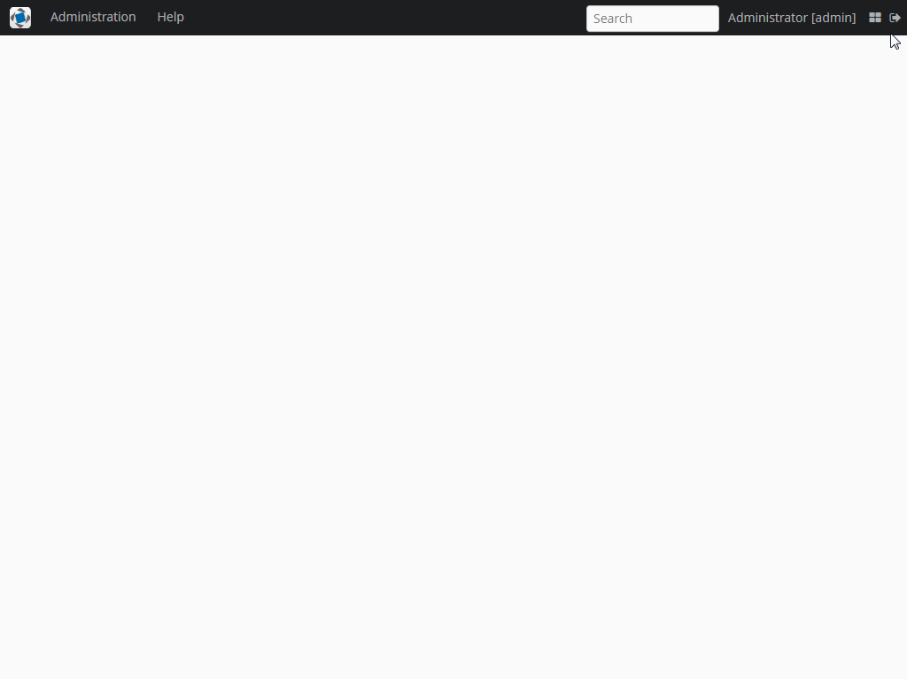

# Rich Search Component



## Main screen installation

1. Add component via Studio in your project
1. Override main screen via Studio interface
1. Add code into **ext-mainwindow.xml** as indicated below:
    ```xml
       <window xmlns="http://schemas.haulmont.com/cuba/window.xsd"
               class="com.haulmont.searchtest.web.screens.ExtAppMainWindow"
               xmlns:search="http://schemas.haulmont.com/cuba/search.xsd"
               xmlns:main="http://schemas.haulmont.com/cuba/mainwindow.xsd"
               messagesPack="com.haulmont.searchtest.web.screens">
           <dialogMode height="600"
                       width="800"/>
           <layout expand="foldersSplit">
               <hbox id="titleBar" stylename="c-app-menubar"
                     expand="mainMenu" width="100%" height="AUTO"
                     spacing="true" margin="false;false;false;true">
       
                   <embedded id="logoImage" align="MIDDLE_LEFT" type="IMAGE" stylename="c-app-icon"/>
       
                   <main:menu id="mainMenu" align="MIDDLE_LEFT"/>
       
                   <search:richSearch id="search" align="MIDDLE_LEFT" suggestionsLimit="200" inputPrompt="msg://searching">
                      <search:strategyBean name="search_MainMenuSearchStrategy" />
                   </search:richSearch>
       
                   <main:ftsField id="ftsField" align="MIDDLE_LEFT"/>   
 
                   <main:userIndicator id="userIndicator" align="MIDDLE_LEFT"/>
       
                   <main:timeZoneIndicator id="timeZoneIndicator" align="MIDDLE_LEFT"/>
       
                   <hbox id="mainButtonsBox" stylename="c-main-buttons" align="MIDDLE_LEFT">
                       <main:newWindowButton id="newWindowButton"
                                             icon="app/images/new-window.png"
                                             description="msg://com.haulmont.cuba.gui/newWindowBtnDescription"/>
       
                       <main:logoutButton id="logoutButton"
                                          icon="app/images/exit.png"
                                          description="msg://com.haulmont.cuba.gui/logoutBtnDescription"/>
                   </hbox>
               </hbox>
       
               <split id="foldersSplit" width="100%" orientation="horizontal" pos="200px">
                   <main:foldersPane id="foldersPane" width="100%" height="100%"/>
       
                   <main:workArea id="workArea" width="100%" height="100%">
                       <main:initialLayout spacing="true" margin="true">
       
                       </main:initialLayout>
                   </main:workArea>
               </split>
           </layout>
       </window>
    ```

## Usage

#### Declarative xml strategy usage:

1. **Bean configuration**

    **xml screen config**:
    ```xml
    <window
        class="com.company.test.web.screens.TestWindow" 
        xmlns:search="http://schemas.haulmont.com/cuba/search.xsd">
        ...
        <layout>
            ...
            <search:richSearch id="search" inputPrompt="msg://searching">
                <search:strategyBean name="search_SearchStrategy" />
            </search:richSearch>
            ...
        </layout>
        ...
    </window>
    ```
    **spring bean**:
    ```java
    @Component("search_SearchStrategy")
    public class MySearchStrategy implements SearchStrategy {
        @Override
        public List<SearchEntry> load(SearchContext context, String query) {
            //searching implementation
        }
   
        @Override
        public void invoke(SearchContext context, SearchEntry value) {
            //choosing behavior implementation
        }
    }
    ```
1. **Frame method referential configuration**

    **xml screen config**:
    ```xml
    <window
        class="com.company.test.web.screens.TestWindow" 
        xmlns:search="http://schemas.haulmont.com/cuba/search.xsd">
        ...
        <layout>
            ...
            <search:richSearch id="search" inputPrompt="msg://searching">
                <search:strategy name="custom strategy" searchMethod="search" invokeMethod="invoke" />
            </search:richSearch>
            ...
        </layout>
        ...
    </window>
    ```
    
    **screen controller**:
    ```java
    public class MyWindowController implements Window {
        public List<SearchEntry> search(SearchContext context, String query) {
            //searching implementation
        }
       
        public void invoke(SearchContext context, SearchEntry searchEntry) {
            //choosing behavior implementation
        }
    }
    ```

#### Programmatically strategy usage:
    
**screen controller**:

```java
    public class MyWindowController implements Window {
    
        @Inject
        private RichSearch search;
    
        @Override
        public void init(Map<String, Object> params) {
            super.init(params);
    
            List<DefaultSearchEntry> variants = new ArrayList<>();
            
            //variants initialisation
            
            search.addStrategy(
                    "custom" /* strategy name */, 
                        (query)-> { /* lambda searching implementation */ },
                        (value)-> { /* lambda choosing behavior */ }
            );
        }
    }
```

## Known issues

1. Search field has not to be cleaned after choosing value [PL-10046](https://youtrack.haulmont.com/issue/PL-10046)
1. Unable to customize the drop-down menu for adding strategy groups [PL-9134](https://youtrack.haulmont.com/issue/PL-9134)
1. Limit the amount of input should be accounted for each strategy separately (No task, discussion need)
1. Add xml declaration for specific strategy params (No task, discussion need)
1. Add keyboard shortcuts for component and settings (No task, discussion need)