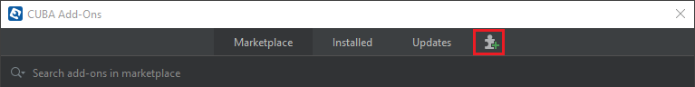

<p>
    <a href="http://www.apache.org/licenses/LICENSE-2.0"></a>
    <a href="https://travis-ci.org/cuba-platform/rich-search-addon"></a>
</p>

# Rich Search

- [Overview](#overview)
- [Installation](#installation)
  - [From the Marketplace](#from-the-marketplace)
  - [By Coordinates](#by-coordinates)
- [Quick Start](#quick-start)
- [Data Model](#data-model)
- [Usage](#usage)
- [Known Issues](#known-issues)

## Overview

The add-on is designed to search for various types of objects using a single field. This out-of-the-box solution enables searching by application menu items.

You can configure your application to search for entities including related ones as well as entity attributes.

Key features:
- A single field for searching.
- Customizable search strategy.


See [sample application](https://github.com/cuba-platform/rich-search-addon-demo) using this add-on.

# Installation

The add-on can be added to your project in one of the ways described below. Installation from the Marketplace is the simplest way. The last version of the add-on compatible with the used version of the platform will be installed.
Also, you can install the add-on by coordinates choosing the required version of the add-on from the table.

In case you want to install the add-on by manual editing or by building from sources see the complete add-ons installation guide in [CUBA Platform documentation](https://doc.cuba-platform.com/manual-latest/manual.html#app_components_usage).

## From the Marketplace

1. Open your application in CUBA Studio. Check the latest version of CUBA Studio on the [CUBA Platform site](https://www.cuba-platform.com/download/previous-studio/).
2. Go to *CUBA -> Marketplace* in the main menu.

 

3. Find the Rich Search add-on there.

 

4. Click *Install* and apply the changes.
The add-on corresponding to the used platform version will be installed.

## By coordinates

1. Open your application in CUBA Studio. Check the latest version of CUBA Studio on the [CUBA Platform site](https://www.cuba-platform.com/download/previous-studio/).
2. Go to *CUBA -> Marketplace* in the main menu.
3. Click the icon in the upper-right corner.

 

4. Paste the add-on coordinates in the corresponding field as follows:

 `com.haulmont.addon.search:search-global:<add-on version>`

 where `<add-on version>` is compatible with the used version of the CUBA platform.

 | Platform Version | Add-on Version |
|------------------|----------------|
| 7.1.X            | 1.5.0             |
| 7.0.X            | 1.4.0             |
| 6.10.X           | 1.3.0             |
| 6.9.X            | 1.2.0             |
| 6.8.X            | 1.0.3             |

5. Click *Install* and apply the changes. The add-on will be installed to your project.

# Quick Start

1. Override the main screen via the Studio interface.
1. Add the following code to `ext-mainwindow.xml`:

**For horizontal menu layout**
```xml
<?xml version="1.0" encoding="UTF-8" standalone="no"?>
<window xmlns="http://schemas.haulmont.com/cuba/window.xsd"
        class="com.company.rs.web.screens.ExtAppMainWindow"
        extends="/com/haulmont/cuba/web/app/mainwindow/mainwindow.xml"
        messagesPack="com.company.rs.web.screens"
        xmlns:ext="http://schemas.haulmont.com/cuba/window-ext.xsd"
        xmlns:search="http://schemas.haulmont.com/cuba/search.xsd">
    <dialogMode height="600"
                width="800"/>
    <layout>
        <hbox id="titleBar">
            <search:richSearch id="search"
                               align="MIDDLE_LEFT"
                               ext:index="3"
                               inputPrompt="msg://search"
                               suggestionsLimit="200">
                <search:strategyBean name="search_MainMenuSearchStrategy"/>
            </search:richSearch>
        </hbox>
    </layout>
</window>
```

**For vertical menu layout**
```xml
<?xml version="1.0" encoding="UTF-8" standalone="no"?>
<window xmlns="http://schemas.haulmont.com/cuba/window.xsd"
        extends="/com/haulmont/cuba/web/app/main/main-screen.xml"
        messagesPack="com.haulmont.demo.richsearch.web.screens"
        xmlns:ext="http://schemas.haulmont.com/cuba/window-ext.xsd"
        xmlns:search="http://schemas.haulmont.com/cuba/search.xsd">
    <dialogMode height="600"
                width="800"/>
    <layout>
        <hbox id="horizontalWrap">
            <vbox id="sideMenuPanel">
                <vbox ext:index="4" margin="true">
                    <search:richSearch id="search"
                                       align="MIDDLE_LEFT"
                                       width="100%"
                                       inputPrompt="msg://search"
                                       suggestionsLimit="200">
                        <search:strategyBean name="search_SideMenuSearchStrategy"/>                        
                    </search:richSearch>
                </vbox>
            </vbox>
        </hbox>
    </layout>
</window>
```

# Data Model

### Search Field

Search Field provides one or several search strategies that are called for each search query.

### Search Strategy

Search Strategy defines which objects should be returned as a result of the current search request.

### SearchEntry

SearchEntry is an interface designed to work with search result objects. Each SearchEntry has an id, caption
and the name of a search strategy that it belongs to specified.

### DefaultSearchEntry

DefaultSearchEntry defines the default implementation of SearchEntry.

### SearchContext

SearchContext provides the context dependent data for the search mechanism, e.g. a user session, additional params.

### HeaderEntry

HeaderEntry implements a header for grouping strategy results.


# Usage

Let us consider an example of how the component can be of use. Start by searching for a system user. The component finds
the required user and opens User Editor.

The system performs search by login. In order to configure the component, use the following code:

```java
LoadContext<User> lc = LoadContext.create(User.class);
lc.setQueryString("select u from sec$User u where u.loginLowerCase like concat('%',:loginLowerCase,'%')")
        .setParameter("loginLowerCase", query.toLowerCase());
```

The sections below present several options to define search strategies.

### Using A Spring Bean As Search Strategy

**Spring bean**:
```java
@Component("search_UsersSearchStrategy")
public class UsersSearchStrategy implements SearchStrategy {
    @Override
    public List<SearchEntry> load(SearchContext context, String query) {
        LoadContext<User> lc = LoadContext.create(User.class);
        lc.setQueryString("select u from sec$User u where u.loginLowerCase like concat('%',:loginLowerCase,'%')")
                .setParameter("loginLowerCase", query.toLowerCase());

        return dataManager.loadList(lc).stream()
                .map(user -> new DefaultSearchEntry(user.getId().toString(), user.getCaption(), name()))
                .collect(Collectors.toList());
    }

    @Override
    public void invoke(SearchContext context, SearchEntry value) {
        LoadContext<User> lc = LoadContext.create(User.class)
                .setId(UuidProvider.fromString(value.getId()));
        User user = dataManager.load(lc);
        AppUI.getCurrent().getTopLevelWindow().openEditor(user, WindowManager.OpenType.NEW_TAB);
    }


    @Override
    public String name() {
        return "usersSearchStrategy";
    }
}
```

**XML screen config**:
```xml
<window
    class="com.company.test.web.screens.TestWindow"
    xmlns:search="http://schemas.haulmont.com/cuba/search.xsd">
    ...
    <layout>
        ...
        <search:richSearch id="search" inputPrompt="msg://search">
            <search:strategyBean name="search_UsersSearchStrategy" />
        </search:richSearch>
        ...
    </layout>
    ...
</window>
```

**Localization**

Add the following entry to the main message pack as it is given below:
```text
searchStrategy.{strategyName} = Strategy name
```
Example:
```text
searchStrategy.usersSearchStrategy = Users
```

### Using Controller Methods

**XML screen config**:
```xml
<window
    class="com.company.test.web.screens.MyWindowController"
    xmlns:search="http://schemas.haulmont.com/cuba/search.xsd">
    ...
    <layout>
        ...
        <search:richSearch id="search" inputPrompt="msg://search">
            <search:strategy name="usersSearchStrategy" searchMethod="search" invokeMethod="invoke" />
        </search:richSearch>
        ...
    </layout>
    ...
</window>
```

**Screen controller**:
```java
public class MyWindowController extends AbstractWindow {

    @Inject
    protected DataManager dataManager;

    public List<SearchEntry> search(SearchContext context, String query) {
        LoadContext<User> lc = LoadContext.create(User.class);
        lc.setQueryString("select u from sec$User u where u.loginLowerCase like concat('%',:loginLowerCase,'%')")
                .setParameter("loginLowerCase", query.toLowerCase());

        return dataManager.loadList(lc).stream()
                .map(user -> new DefaultSearchEntry(user.getId().toString(), user.getCaption(), "usersSearchStrategy"))
                .collect(Collectors.toList());
    }

    public void invoke(SearchContext context, SearchEntry searchEntry) {
        LoadContext<User> lc = LoadContext.create(User.class)
                .setId(UuidProvider.fromString(searchEntry.getId()));
        User user = dataManager.load(lc);
        AppUI.getCurrent().getTopLevelWindow().openEditor(user, WindowManager.OpenType.NEW_TAB);
    }
}
```

### Using Programmatic Strategy

**Screen controller**:

```java
public class MyWindowController extends AbstractWindow {

    @Inject
    protected DataManager dataManager;

    @Inject
    protected RichSearch search;

    @Override
    public void init(Map<String, Object> params) {
        super.init(params);

        search.addStrategy("usersSearchStrategy", query -> {
            LoadContext<User> lc = LoadContext.create(User.class);
            lc.setQueryString("select u from sec$User u where u.loginLowerCase like concat('%',:loginLowerCase,'%')")
                    .setParameter("loginLowerCase", query.toLowerCase());

            return dataManager.loadList(lc).stream()
                    .map(user -> new DefaultSearchEntry(user.getId().toString(), user.getCaption(), "usersSearchStrategy"))
                    .collect(Collectors.toList());
        }, searchEntry -> {
            LoadContext<User> lc = LoadContext.create(User.class)
                    .setId(UuidProvider.fromString(searchEntry.getId()));
            User user = dataManager.load(lc);
            AppUI.getCurrent().getTopLevelWindow().openEditor(user, WindowManager.OpenType.NEW_TAB);
        });
    }
}
```

The result is:


## Known issues

1. The available amount of input should be accounted for each strategy separately (no task, to be discussed).
1. It is required to add an XML declaration for specific strategy parameters (no task, to be discussed).
1. It is required to add keyboard shortcuts for the component and its settings (no task, to be discussed).
